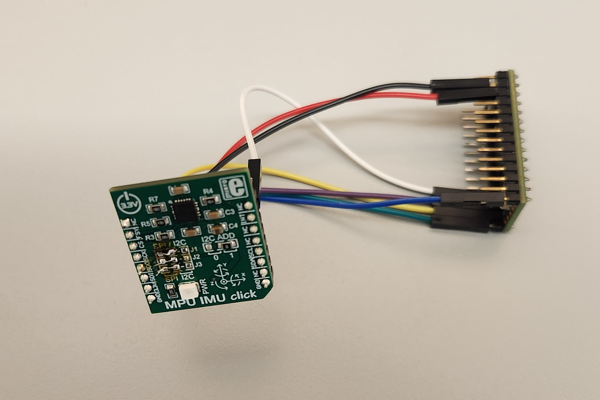

## About

This is a header-only Arduino library for the InvenSense/TDK MPU6000 and MPU6500 inertial measurement units using
the SPI bus.

## Use cases

I have tested this library on the following hardware:

* [MikroE MPU IMU Click](https://www.mikroe.com/mpu-imu-click) with [Teensy 4.0](https://www.pjrc.com/store/teensy40.html) development board.
As shown in the photo above, you have to remove the zero-Ohm resistors on the MikroE's I2 
pads and solder a bridge across the adjacent SPI pads.

* [BetaFPV F405 flight controller](https://betafpv.com/products/toothpick-f405-2-4s-aio-brushless-flight-controller-20a-blheli_32-v4)
